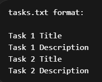

<h1 align = "center"> Java CLI To-Do App</h1>

<h2 align = "center">Description</h2> 

This is a simple command-line based To-Do application developed in Java. It allows users to manage daily tasks by adding, viewing, and removing them.
The application uses file handling to store tasks permanently, so data is preserved even after the program is closed.

<h2 align = "center">Features</h2> 

  <ul>
    <li>Add new tasks with title and description</li>
    <li>View all task titles</li>
    <li>View all task descriptions</li>
    <li>View complete task details</li>
    <li>Remove tasks by ID</li>
    <li>Persistent storage using a text file (tasks.txt)</li>
  </ul>

<h2 align = "center">How it works</h2> 

  <h4>The application uses two parallel data structures:</h4>
  <ol>
    <li>ArrayList<String> titles</li>
    <li>ArrayList<String> descriptions</li>
    </ol>
  <h4>Each task is stored as:</h4>
      <ol>
        <li>One title</li>
        <li>One description</li>
      </ol>
  <h4>File Handling Logic:</h4>
      <ul>
        <li>On startup → Reads tasks from tasks.txt</li>
        <li>On adding a task → Saves data to file</li>
      </ul>
  <h4>Each task occupies 2 lines in the file:</h4>
    <ul>
      <li>Title</li>
      <li>Description</li>
    </ul>

      
<h2 align = "center">File Structure</h2>

 
<h4>Important:</h4>
<ul>
<li>The order must remain consistent</li>
<li>Each task strictly uses two lines</li>

<h2 align = "center">Installation and Setup</h2> 

<h2 align = "center">Usage</h2> 

<h2 align = "center">Limitations</h2> 

<h2 align = "center">Future Improvements</h2> 

<h2 align = "center">License</h2> 
